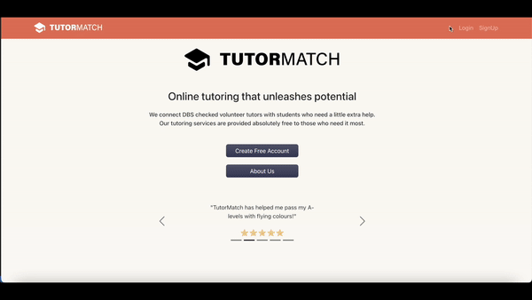
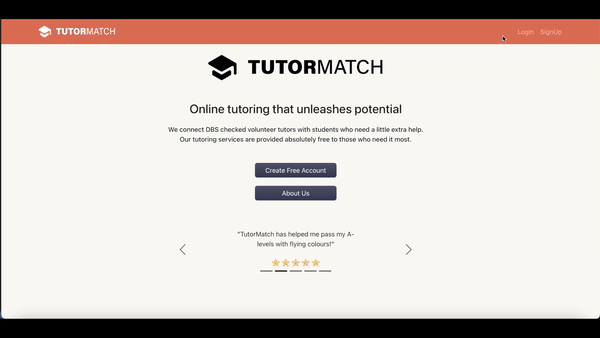

### Summary

Tutor Match is a group project completed on the Makers Academy software development bootcamp.

The brief for the project was to design and build a product that adhered to the self selected theme of "tech for good"

[tutormatch.dangullis.com](tutormatch.dangullis.com)

If you would like to have a look around please use these details

- email: emma@email.com
- password: Password123!

### Demos

Student login > search tutor > booking request > update profile picture and bio > logout

Tutor login > add subject > accept booking requests > update availability > logout

### Description

Over two weeks as a team we developed the following user features

- login
- signup as a tutor or student
- upload profile pictures
- create and edit about me section
- as a student
  - search for tutors by subject / grade
  - request to book a tutoring session with a tutor
  - leave a review for a tutor
  - see interactive calendar showing requested and acepted bookings

- as a tutor
  - select subjects and grades you are available to tutor
  - add hour time slots you are available to tutor
  - accept or deny requests for tutoring sessions
  - see interactive calendar showing your availability / bookings

### Working Process

Embracing Agile methodologies involving iterative development cycles, daily stand-ups and sprint planning to define and prioritise tasks. Organised workflow through a ticket system to ensure tracking and management of tasks throughout the project.

### Contributors

- [Dan Gullis](https://github.com/dgullis)
- [Simon Budden](https://github.com/fantastito)
- [Ann Galloway](https://github.com/AnnGalloway)
- [Kat Bielecka](https://github.com/KatBiel)
- [Leah Simon](https://github.com/nsleeah)
